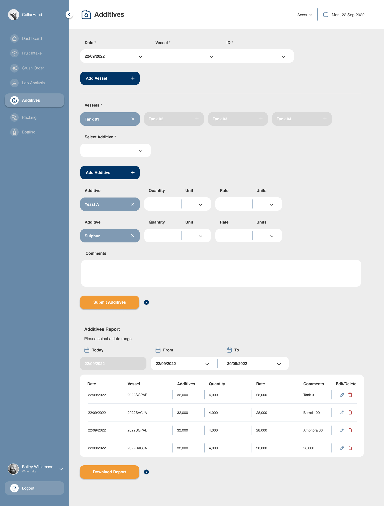
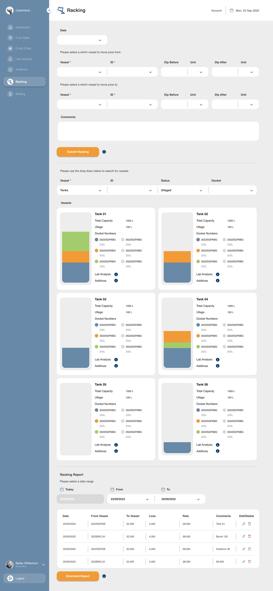
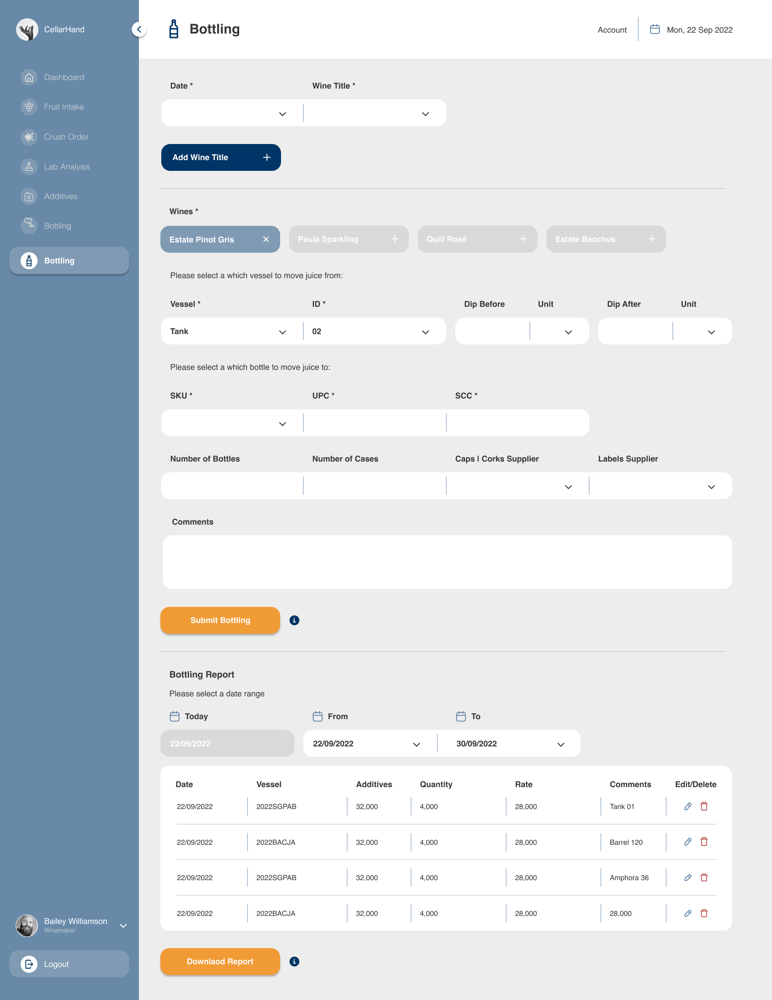

# Project Title
cellarhand

## Overview

For this project I will be specifically concentrating on setting up the Fruit Intake Page as this project requires heavy back-end capabilities. The information below explains the scope for the full program capabilities in the future.

CellarHand is a user-friendly web application revolutionizing winemaking, efficiently tracking the entire process from grape to bottle. With an intuitive interface, it simplifies data entry, enabling winemakers to monitor harvests, fermentation, aging, and more. Offering real-time insights, batch management, and label creation, CellarHand optimizes production workflows, ensuring high-quality wines.

### Problem

CellarHand addresses the prevalent issues in winemaking software by tackling the complexity, steep learning curve, and lack of user-friendly features in existing programs. The primary problem it solves is the difficulty winemakers face with convoluted software that often requires extensive training. CellarHand simplifies the winemaking process by adhering to the step-by-step methods familiar to winemakers, eliminating the need for a radical shift in their approach. The platform aims to make the entire winemaking journey—from grape to bottle—more accessible, intuitive, and transparent, providing a solution that enhances efficiency and ensures smooth collaboration across the winemaking team and beyond.

### User Profile

- Winemakers:
    - Winemakers, whether they are the owners of a winery or employed by one, are the key users of CellarHand. They utilize the platform to manage and streamline   the entire winemaking process, from grape to bottle.

- Cellar Masters:
    - Cellar masters or cellar hands responsible for day-to-day operations in the winery use CellarHand to track and manage fruit intakes, vessel contents, blending, additives, lab analyses, and bottling.

- Administrative Staff:
    - Administrative staff, including accountants and office managers, utilize the reporting features in CellarHand for financial and inventory reporting, ensuring transparency and accuracy in business operations.

### Features

- Create dockets for different wine varietals by inputting details like vintage, grower, varietal, vineyard, block, and row.

- Log fruit intakes effortlessly, incorporating dockets along with the weight and predicted volume of juice, ensuring accurate raw material tracking.

- Generate crush orders within CellarHand, specifying the destination vessels (tanks, amphoras, barrels) for processed grape juice from fruit intakes.

- Efficiently manage various vessels, allowing users to assign and monitor the status of wine in tanks, amphoras, barrels, and other containers.

- Facilitate the racking process, enabling users to mix wines from different vessels to achieve desired blending and aging outcomes.

- Record and track additives introduced into wine vessels, providing a comprehensive overview of ingredients used during the winemaking process.

- Utilize lab analysis features, including monitoring sugar and acid content, ensuring accurate and up-to-date information about the chemical composition of wines.

- Streamline the bottling process within CellarHand, allowing users to document the final stage of production, including details about bottles and the percentage of each docket in each bottle.

- Ensure traceability throughout the winemaking journey, providing detailed reports that allow users to follow the progression of each docket and understand the distribution of wines across various vessels and bottles by the end of the process.

- Navigate the winemaking process effortlessly with CellarHand's user-friendly interface, ensuring an intuitive experience for winemakers without a steep learning curve.

## Implementation

### Tech Stack

- React
- MySQL
- Express
- Client libraries: 
    - react
    - react-dom
    - react-router-dom
    - axios
    - sass

- Server libraries:
    - knex
    - express
    - nodemon
    - cors
    - dotenv
    - mysql2

### APIs

- No external APIs will be used

### Sitemap

- Dashboard
- Fruit Intake **This page will be the focus for my demo due to time constraints**
- Crush Order
- Additives
- Lab Analysis
- Racking
- Bottling
- Settings

### Mockups

#### Fruit Intake Page
 **This page will be the focus for my demo due to time constraints**

#### Crush Order Page


#### Additives Page


#### Lab Analysis Page


#### Racking Page


#### Bottling Page



### Endpoints **The following endpoint are focused on the fruit intake page for my demo due to time constraints**

**POST /docket**

- Post singular docket created by user

    - Request Body:

    vintage (number): The year the vintage was produced (e.g., 2024).
    grower (string): The grower's name.
    varietal (string): The type of grape varietal.
    vineyard (string): The vineyard's name.
    block (string/number): The block identifier.
    row (string/number): The row identifier.
    
    - Response (201 - Created):

    docket_name (string): The generated docket name based on input parameters.
    vintage (number): The year the vintage was produced.
    grower (string): The grower's name.
    varietal (string): The type of grape varietal.
    vineyard (string): The vineyard's name.
    block (string/number): The block identifier.
    row (string/number): The row identifier.
    
    - Error Responses:

    400 - Bad Request: Invalid or missing input fields.
    500 - Internal Server Error: Error creating docket.


Response:
```
{
    "docket_name": "20232340588",
    "vintage": 2023,
    "grower": "2",
    "varietal": "3",
    "vineyard": "4",
    "block": "5",
    "row": "88"
}
```

**GET /dockets/**

- Get array of all dockets created by user

    - Response (200 - OK):

    docket_id (number): The unique identifier for the docket.
    docket_name (string): The generated docket name.
    
    - Error Response:

    500 - Internal Server Error: Error retrieving dockets.

Response:
```
[
    {
        "docket_name": "20232340588",
        "vintage": 2023,
        "grower": "2",
        "varietal": "3",
        "vineyard": "4",
        "block": "5",
        "row": "88"                     
    },
    ...
]
```

**POST /intake/**

- Post single intake created by user

    - Request Body:

    docket_id (number): The unique identifier of the associated docket.
    intake_date (string): The date of the intake.
    bins (number): The number of bins used for the intake.
    total_weight (number): The total weight of the intake.
    tare_weight (number): The tare weight of the bins.
    
    - Response (201 - Created):

    docket_id (number): The unique identifier of the associated docket.
    intake_date (string): The date of the intake.
    bins (number): The number of bins used for the intake.
    total_weight (number): The total weight of the intake.
    tare_weight (number): The tare weight of the bins.
    fruit_weight (number): The calculated weight of the fruit (TODO: calculation).
    predicted_volume (number): The predicted volume of the intake (TODO: calculation).
    
    - Error Responses:

    400 - Bad Request: Invalid or missing input fields.
    500 - Internal Server Error: Error creating intake.

Response:
```
{
    "intake_id": 4,
    "docket_id": 6,
    "intake_date": "2023-04-10T17:39:37.000Z",
    "bins": 1,
    "total_weight": 1,
    "tare_weight": 1,
    "fruit_weight": 0,
    "predicted_volume": 0,
    "docket_name": "2024SOPICA0103"
}
```

**GET /intakes/**

- Get array of all intakes created by user

    - Response (200 - OK):

    intake_id (number): The unique identifier for the intake.
    docket_id (number): The unique identifier of the associated docket.
    docket_name (string): The generated docket name.
    intake_date (string): The date of the intake.
    bins (number): The number of bins used for the intake.
    total_weight (number): The total weight of the intake.
    tare_weight (number): The tare weight of the bins.
    fruit_weight (number): The calculated weight of the fruit.
    predicted_volume (number): The predicted volume of the intake.
    
    - Error Response:

    500 - Internal Server Error: Error retrieving intakes.

Response:
```
[
    {
        "intake_id": 4,
        "docket_id": 6,
        "intake_date": "2023-04-10T17:39:37.000Z",
        "bins": 1,
        "total_weight": 1,
        "tare_weight": 1,
        "fruit_weight": 0,
        "predicted_volume": 0,
        "docket_name": "2024SOPICA0103"
    },
    ...
]
```

## Roadmap

- Create SQL Database:
    - Design the SQL database schema to include tables for dockets and intakes, establishing relationships between them.

- Create Client:
    - Set up a React project with routes and boilerplate pages to establish the foundation of the client-side application.

- Create Server:
    - Develop an Express project with routing to create the server-side infrastructure.

- Deploy Client and Server Projects:
    - Deploy the client and server projects to a hosting service (e.g., Heroku, Netlify) to ensure that all commits are reflected in the production environment.

- Feature: Post Dockets with Validation:
    - Implement a page or form to allow users to post new dockets.
    - Create a POST /api/dockets endpoint on the server to handle the creation of new dockets and insert data into the SQL database.
    - Implement error handling to display meaningful messages to users for validation failures.

- Feature: Get Dockets:
    - Implement a page to display a list of existing dockets.
    - Create a GET /api/dockets endpoint on the server to fetch and display a list of dockets from the SQL database.

- Feature: Post Intakes with Validation:
    - Develop a page or form to enable users to post new intakes linked to specific dockets.
    - Create a POST /api/intakes endpoint on the server to handle the creation of new intakes associated with dockets and update the SQL database accordingly.
    - Implement error handling to display meaningful messages to users for validation failures.

- Feature: Get Intakes:
    - Implement a page to display details of a specific intake, including linked dockets.
    - Create a GET /api/intakes endpoint on the server to fetch and display information for a specific intake from the SQL database.

- Feature: Download Intakes Report (CSV):
    - Implement functionality to download intake details, possibly in CSV format.
    - Create a button or link triggering a GET /api/intakes/report endpoint on the server to generate and download a CSV report for a specific intake.

- Feature: Edit and Delete Dockets:
    - Enable users to edit and delete existing dockets.
    - Create PUT /api/dockets and DELETE /api/dockets endpoints on the server to handle updates and deletions in the SQL database.

- Feature: Edit and Delete Intakes:
    - Enable users to edit and delete existing intakes.
    - Create PUT /api/intakes and DELETE /api/intakes endpoints on the server to handle updates and deletions in the SQL database.

- Feature: Filter and Search Dockets and Intakes:
    - Implement functionality to filter and search for dockets based on various criteria.
    - Create corresponding endpoints on the server (GET /api/dockets/search and GET /api/intakes/search) to handle filtering and searching in the SQL database.

- Bug Fixes:
    - Conduct thorough testing and address any bugs or issues identified during the development process.

- Demo Day:
    - Showcase the completed CellarHand application in a demo to stakeholders, highlighting its features and functionalities.

## Nice-to-haves

- Crush Order, and Racking Pages
- Filter and search bar functionality
- Calendar date picker functionality
- Login capabilities